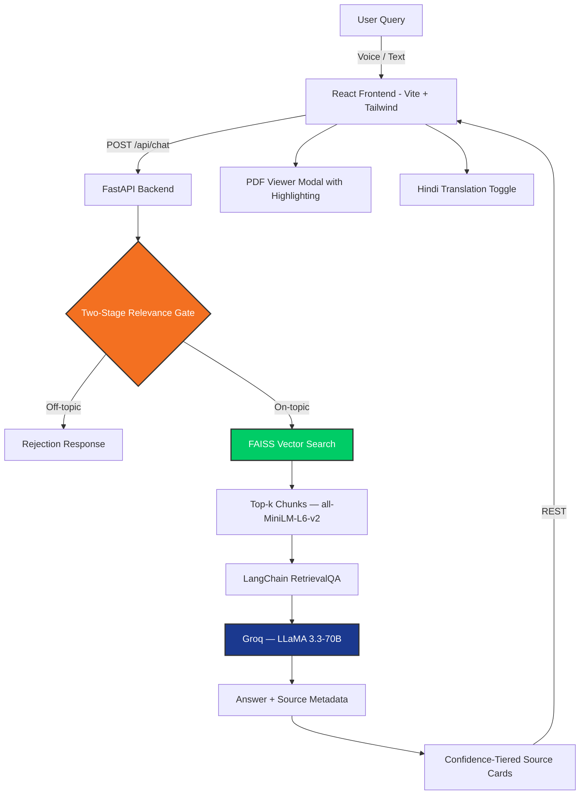

# PolicyIQ — IOCL Regulatory Compliance Assistant

An AI-powered RAG chatbot built for **Indian Oil Corporation Limited (IOCL)** that answers complex compliance questions across 29 official regulatory documents — OISD, PESO, PNGRB, and MoPNG standards — with source citations, confidence scoring, and conversational memory.

   

## Tech Stack


## Features

- **RAG Pipeline**: Retrieves relevant chunks from 7,038 indexed passages across 29 regulatory PDFs using FAISS vector search and `all-MiniLM-L6-v2` embeddings.
- **Two-Stage Relevance Gating**: Filters out off-topic queries before hitting the LLM — preventing hallucination on out-of-scope questions.
- **Confidence-Tiered Source Cards**: Every answer surfaces clickable source cards with document name, page number, and a relevance confidence score.
- **8-Turn Conversational Memory**: Maintains context across follow-up queries (e.g. "and what about capacity?" resolves correctly).
- **Hindi Translation Toggle**: Per-message Hindi translation for field engineers who prefer vernacular responses.
- **Voice Input**: Browser-native speech-to-text for hands-free querying on the refinery floor.
- **PDF Viewer Modal**: In-app PDF viewer with passage highlighting — jump directly to the cited paragraph.
- **Admin Panel**: Upload new documents, view feedback logs, monitor indexed corpus.
- **Feedback Loop**: 👍 / 👎 per response, logged to `data/feedback_log.jsonl` for manual curation and retrieval tuning.

---

## Architecture



---

## Project Structure

```
backend/          → FastAPI app, RAG pipeline (LangChain + Groq)
├── rag/          → retriever.py, generator.py, pipeline.py
├── routers/      → chat.py, admin.py
frontend/         → React 18 chat interface (Vite + Tailwind)
├── src/
│   ├── components/   → ChatMessage, PDFViewerModal, VoiceInput, Sidebar
│   ├── pages/        → Chat, Admin, Landing
indexing/         → PDF parsing, chunking, embedding, deduplication
data/             → feedback_log.jsonl, eval_set.json, thumbnails
docs/learning/    → Full RAG architecture walkthrough (10 chapters)
.env.example      → Environment variable template
requirements.txt  → Python dependencies
```

---

## Prerequisites

- Python 3.10+
- Node.js 18+ and npm
- A free [Groq API key](https://console.groq.com)

---

## Local Setup

### 1. Clone the repo

```bash
git clone https://github.com/savya14/policyiq.git
cd policyiq
```

### 2. Set up environment variables

```bash
cp .env.example .env
```

Edit `.env` and add your key:

```env
GROQ_API_KEY=your_groq_api_key_here
```

### 3. Install Python dependencies

```bash
pip install -r requirements.txt
```

### 4. Add regulatory documents

Place your PDF documents in `data/raw/`. PolicyIQ is built for OISD, PESO, PNGRB, and MoPNG standards.

> PDFs are not included due to copyright. Obtain official copies from OISD/PESO/PNGRB directly.

### 5. Build the vector index

```bash
python -m indexing.build_index
```

Parses all PDFs, chunks them, generates embeddings, and saves the FAISS index to `vector_store/`. Run once, or when adding new documents.

### 6. Run the backend

**Terminal 1:**
```bash
uvicorn backend.main:app --reload --port 8000
```

### 7. Run the frontend

**Terminal 2:**
```bash
cd frontend
npm install
npm run dev
```

Frontend: `http://localhost:5173` | Backend: `http://localhost:8000`

---

## Adding New Documents

```bash
# Standard add
python -m indexing.update_index path/to/new_document.pdf

# Force-add errata / amendment covering an existing standard
python -m indexing.update_index path/to/errata.pdf --force
```

---

## Document Corpus

| # | Standard | Document | Chunks |
|---|----------|----------|--------|
| 02 | OISD-STD-116 | Fire Protection — Refineries | 332 |
| 03 | OISD-STD-117 | Fire Protection — Depots | 382 |
| 04 | OISD-STD-105 | Work Permit Case Studies | 18 |
| 08 | OISD Pipeline | Pipeline Safety Management | 554 |
| 09 | PNGRB T4S 2017 | Petroleum Pipeline Standards | 400 |
| 10 | PNGRB ERDMP 2020 | Emergency Response Regulations | 308 |
| 11 | PESO | Gas Cylinders Rules SOP | 220 |
| 27 | OISD-STD-144 | LPG Installations (Full, 267 pages) | 1,276 |
| 29 | OISD-STD-194 | LNG Handling & Storage | 592 |
| 30 | OISD-STD-190 | Drilling Safety — Onshore & Offshore | 391 |
| … | … | 29 documents total | **7,038 chunks** |

---

## Evaluation

### Factual Accuracy (Happy-Path)

| Query | Answer | Source |
|-------|--------|--------|
| Min. safe distance, LPG vessel 10-20 Cu.Mt. | ✅ 15m | ✅ OISD-STD-144, Page 25 |
| Safe distance, pressurized LPG tank >3800 Cu.Mt. | ✅ 120m | ✅ OISD-STD-144, Page 25 |
| Work permit categories | ✅ 4 categories | ✅ OISD-STD-105 |
| Fire hydrant spacing (refinery) | ✅ 45m | ✅ OISD-STD-116 |

### Retrieval Benchmarks (15 complex compliance queries)

| Config | Recall@5 | Recall@7 | Recall@10 |
|--------|----------|----------|-----------|
| chunk=512, overlap=64 | 86.7% | 93.3% | 100% |
| chunk=600, overlap=200 | 93.3% | 93.3% | 100% |

---

## Future Scope

- [ ] **Docker Deployment** — Containerize backend + frontend with Docker Compose for one-command setup
- [ ] **Automatic Index Updates** — Watch folder for new PDFs and trigger re-indexing automatically
- [ ] **Multi-language Support** — Extend Hindi toggle to Odia, Telugu, and other regional languages
- [ ] **Role-based Access** — Separate views for field engineers vs. compliance officers vs. admins
- [ ] **LLM Fallback Chain** — Failover to alternate models if Groq is unavailable
- [ ] **Semantic Reranking** — Add a cross-encoder reranker stage after FAISS retrieval for better precision

---

## License

This project is licensed under the MIT License.

---

## Built By

**Savya Raj** — AI Intern, IOCL Paradip Refinery (Summer 2026)  
B.Tech Information Technology, MIT, Bengaluru (Batch 2028)