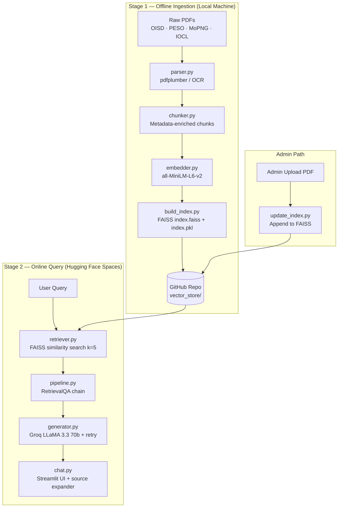
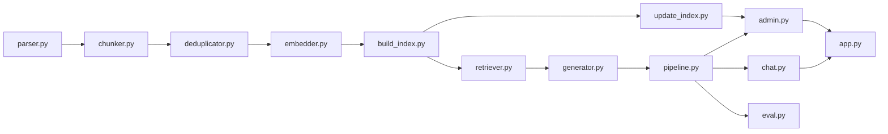

# PolicyIQ — Implementation Roadmap

> **Project:** RAG-Based Document Intelligence System for IOCL Oil & Gas Regulatory Compliance  
> **Stack:** Python 3.11 · LangChain 0.2.16 · FAISS · Groq LLaMA 3.3 70b · Streamlit · HF Spaces  
> **Source Blueprint:** [PolicyIQ_Blueprint.md](file:///Users/savyaraj/Desktop/policyiq/PolicyIQ_Blueprint.md)

---

## Architecture at a Glance



---

## Phase Summary

| Phase | Name | Days | Key Deliverable |
|-------|------|------|----------------|
| **0** | Environment Setup | Day 1 | Repo + venv + `.env` + `import langchain` succeeds |
| **1** | Document Collection & Parsing | Days 2–3 | Clean structured text from all PDFs with page/section metadata |
| **2** | FAISS Index Build | Day 4 | `index.faiss` + `index.pkl` committed to GitHub |
| **3** | RAG Pipeline Core | Days 5–6 | `ask()` returns cited answers; out-of-scope refusals work |
| **4** | Streamlit App | Days 7–8 | Full UI working locally end-to-end |
| **5** | Evaluation & Tuning | Days 9–10 | `eval_results.csv` with real measured numbers; ≥70% accuracy |
| **6** | Deployment | Day 11 | Live on Hugging Face Spaces, README complete |

---

## Phase 0 — Environment Setup *(Day 1)*

### Goal
Clean, reproducible dev environment before any code is written.

### Tasks
1. Create GitHub repo `policyiq` and scaffold the full folder structure (see §File Structure below)
2. Create Python 3.11 virtual environment and activate it
3. Create `requirements.txt` with **exact pinned versions** from blueprint — do not deviate
4. Install all dependencies: `pip install -r requirements.txt`
5. Install system dependencies (Tesseract + poppler):
   - Mac: `brew install tesseract poppler`
   - Ubuntu/HF Spaces: `sudo apt install tesseract-ocr poppler-utils`
6. Create `.env` with `GROQ_API_KEY` and `ADMIN_PASSWORD`
7. Create `.env.example` (commit this; never commit `.env`)
8. Create `.gitignore` — include `.env`, `venv/`, `__pycache__/`, `data/raw/`

> [!IMPORTANT]
> **Do NOT add `vector_store/` to `.gitignore`.** The FAISS index files must be committed to GitHub so Hugging Face Spaces can load them on startup.

9. Write README skeleton and commit
10. Validation gate: `python -c "import langchain; import langchain_community; import langchain_groq"` must succeed with no errors

### Pinned Dependency Versions (copy exactly)
```
langchain==0.2.16
langchain-community==0.2.16
langchain-core==0.2.38
langchain-groq==0.1.9
langchain-huggingface==0.0.3
faiss-cpu==1.8.0
sentence-transformers==3.1.1
pdfplumber==0.11.4
pdf2image==1.17.0
pytesseract==0.3.13
groq==0.11.0
streamlit==1.38.0
python-dotenv==1.0.1
tenacity==8.5.0
```

> [!CAUTION]
> LangChain breaks constantly between minor versions. **Never change these versions without testing.** If any import fails, pin with `--force-reinstall`.

---

## Phase 1 — Document Collection & Parsing *(Days 2–3)*

### Goal
Build a high-quality corpus. Answer quality is directly proportional to corpus quality.

### Document Sources (all free, all public)

| Document | Source URL | Subfolder |
|----------|-----------|-----------|
| OISD-116 (Electrical Safety) | oisd.co.in | `data/raw/oisd/` |
| OISD-118 (Tank Farm Safety) | oisd.co.in | `data/raw/oisd/` |
| OISD-141 (Fire Protection) | oisd.co.in | `data/raw/oisd/` |
| OISD-150 (Loading/Unloading) | oisd.co.in | `data/raw/oisd/` |
| PESO Act | peso.gov.in | `data/raw/peso/` |
| MoPNG Safety Guidelines | ppac.gov.in | `data/raw/mopng/` |
| IOCL Annual Report | iocl.com/investor | `data/raw/iocl/` |

> [!TIP]
> Download 8–12 PDFs minimum. Use meaningful filenames: `OISD_118_Tank_Farm_Safety.pdf`. More documents = better coverage = higher eval accuracy.

### Files to Build (in order)

#### 1. `indexing/parser.py`
**Purpose:** Route each PDF to the correct parser — digital text extraction (pdfplumber) or OCR (pdf2image + Tesseract at 300 DPI).

Key functions:
- `is_scanned(pdf_path)` → checks if avg text/page < 100 chars
- `parse_digital(pdf_path)` → pdfplumber page-by-page extraction
- `parse_scanned(pdf_path)` → convert_from_path at 300 DPI → pytesseract
- `parse_document(pdf_path)` → routes to correct parser, prints which was used

> [!NOTE]
> 300 DPI is mandatory for OCR on safety documents. Lower DPI causes decimal corruption (e.g., `l5 meters` instead of `15 meters`) which corrupts retrieved values.

#### 2. `indexing/chunker.py`
**Purpose:** Split parsed text into metadata-enriched chunks that preserve regulatory clause hierarchy.

Key functions:
- `extract_section_hierarchy(text)` → regex detects OISD-style headers (e.g., `4.1.2`, `SECTION 4 - FIRE PROTECTION`) → returns `"Section 4.1.2"`
- `inject_metadata_prefix(text, section_path, source)` → prepends `[Context: {source} | {section_path}]\n` to each chunk
- `chunk_document(parsed_pages, chunk_size=800, chunk_overlap=150)` → returns `list[Document]` with `{source, page, section}` metadata

> [!NOTE]
> Metadata injection is the key architectural differentiator. When a chunk boundary falls mid-section, the LLM still sees which document and section the text came from — critical for correct citations.

### Phase 1 Validation Gate (mandatory before proceeding to Phase 2)

Run chunking validation on at least 2 OISD documents:
```python
from indexing.parser import parse_document
from indexing.chunker import chunk_document

doc = parse_document("data/raw/oisd/OISD_118_Tank_Farm_Safety.pdf")
chunks = chunk_document(doc)
for i, chunk in enumerate(chunks[:10]):
    print(f"Section path: {chunk.metadata.get('section', 'MISSING')}")
    print(f"Source: {chunk.metadata.get('source', 'MISSING')}")
```

**Pass criteria:** `section` metadata populated (not `MISSING`/`Unknown`) in >70% of chunks. If it fails: tune the section hierarchy regex in `chunker.py` for that document's formatting before proceeding.

---

## Phase 2 — FAISS Index Build *(Day 4)*

### Goal
Build the vector index and verify retrieval quality.

### Files to Build (in order)

#### 1. `indexing/deduplicator.py`
**Purpose:** SHA-256 hash tracking to prevent the same PDF being indexed twice.

Key functions: `compute_sha256`, `load_hashes`, `save_hashes`, `is_already_indexed`, `mark_as_indexed`, `remove_from_index`

Persists state to `data/indexed_hashes.json` — **must be committed to GitHub**.

#### 2. `indexing/embedder.py`
**Purpose:** Initialize the embedding model (MiniLM-L6-v2, 80MB, runs offline).

Key function: `get_embedding_model()` → returns `HuggingFaceEmbeddings` with `device: cpu`

> [!NOTE]
> First run downloads ~80MB model to `~/.cache/huggingface`. Print a warning to the user. Subsequent calls are instant.

#### 3. `indexing/build_index.py`
**Purpose:** One-time local script to build the full FAISS index from all documents.

Flow: Find all PDFs → check deduplicator → parse → chunk → collect all chunks → `FAISS.from_documents()` → `save_local("vector_store/")`

> [!CAUTION]
> **Never run `build_index.py` on Hugging Face Spaces.** The free-tier CPU will OOM or timeout. The index must be pre-built locally and committed to GitHub.

#### 4. `indexing/update_index.py`
**Purpose:** Append a single new PDF to an existing FAISS index. Called by the admin panel.

Function signature: `update_index(pdf_path) → tuple[bool, str]`

Flow: Check index exists → check deduplicator → parse → chunk → load existing FAISS → `add_documents()` → `save_local()` → `mark_as_indexed()`

### Phase 2 Validation Gate

After `python indexing/build_index.py` completes:
1. Verify `vector_store/index.faiss` and `vector_store/index.pkl` exist
2. Run manual retrieval test:
   ```python
   results = retriever.invoke("minimum safe distance LPG storage tank")
   ```
3. **Pass criteria:** All 5 results have `section` metadata, `source` matches a real document name, content visibly relates to the query
4. If results are irrelevant: reduce `chunk_size` to 600, increase `chunk_overlap` to 200, delete `vector_store/`, rebuild
5. Commit both files + `indexed_hashes.json` to GitHub

---

## Phase 3 — RAG Pipeline Core *(Days 5–6)*

### Goal
Build the end-to-end retrieval + generation pipeline. This is the intellectual core of the system.

### Files to Build (in order)

#### 1. `rag/__init__.py`
Empty file to make `rag/` a Python package.

#### 2. `rag/retriever.py`
**Purpose:** Load the FAISS index and return a retriever object.

Key function: `get_retriever(k=5)` → initializes embeddings → loads FAISS with `allow_dangerous_deserialization=True` → returns `vectorstore.as_retriever(search_type="similarity", search_kwargs={"k": k})`

> [!NOTE]
> `allow_dangerous_deserialization=True` is safe here — you built the index. LangChain added this guard for untrusted third-party pickle files.

#### 3. `rag/generator.py`
**Purpose:** Initialize Groq LLM + system prompt + retry logic.

Key components:
- `SYSTEM_PROMPT` string — copy from §7 of the blueprint **verbatim**
- `load_llm()` → `ChatGroq(model="llama-3.3-70b-versatile", temperature=0.2, max_tokens=1024)`
- `invoke_with_retry(chain, query)` → decorated with `@retry(stop=stop_after_attempt(3), wait=wait_exponential(min=2, max=10), retry=retry_if_exception_type(RateLimitError))`

> [!IMPORTANT]
> The Groq free tier allows 30 req/min and 6000 tokens/min. The retry decorator with exponential backoff is not optional — under demo load, rate limits will be hit.

#### 4. `rag/pipeline.py`
**Purpose:** Assemble the full RetrievalQA chain and expose the `ask()` interface.

Key components:
- `@st.cache_resource build_chain()` → creates `RetrievalQA` with `return_source_documents=True` — this caches the chain for the session, critical for performance
- `ask(question)` → calls `invoke_with_retry`, returns `{"answer": str, "sources": list[dict]}`

> [!CAUTION]
> If `@st.cache_resource` is missing from `build_chain()`, the index is re-embedded on every single query. This causes 30+ second response times and CPU spikes. This is the most common performance bug.

### System Prompt (copy verbatim into `rag/generator.py`)
```
You are PolicyIQ, an AI assistant for IOCL (Indian Oil Corporation Limited)
safety and compliance document queries.

RULES — follow all of these strictly and without exception:

1. Answer ONLY from the provided document context below. Under no circumstances
   use your training knowledge to answer. If the provided context does not
   contain enough information, use the refusal message in Rule 3. There are no
   exceptions to this rule.

2. Every answer must cite the source document name and page number in this exact
   format: [Source: DOCUMENT_NAME, Page: X]. An answer without this citation
   is invalid.

3. If the answer is not present in the provided context, respond with exactly
   this message and nothing else: "This information is not found in the indexed
   documents. Please consult the relevant OISD/PESO guidelines directly."

4. Be concise and precise. Format numerical values, distances, pressures, and
   safety limits clearly. Use bullet points for multi-part answers.

5. If the query involves multiple documents, cite each source separately on a
   new line.

6. Never say "based on my knowledge" or "I believe" — only state what the
   provided context says.

Context:
{context}

Question: {question}

Answer:
```

### Phase 3 Validation Gate (CLI tests — run before touching the UI)

```bash
python rag/pipeline.py
```

| Test Query | Expected Result |
|-----------|----------------|
| `"minimum safe distance for LPG storage near a process unit?"` | Answer references OISD, includes a number |
| `"inspection interval for fire hydrant systems?"` | Cites a document and section number |
| `"What is the GDP of India?"` | **Must** return exact refusal message |
| `"Who is the CEO of IOCL?"` | **Must** return exact refusal message |
| `"pressure limits for petroleum pipelines per OISD-141?"` | Numerical value with citation |

- If in-scope queries fail → retrieval problem → re-check FAISS index
- If refusal tests fail → lower temperature to 0.0, strengthen Rule 1 in system prompt

---

## Phase 4 — Streamlit App *(Days 7–8)*

### Goal
Build the full two-portal Streamlit application with session management and admin gating.

### Files to Build (in order)

#### 1. `app.py` — Entry Point
**Purpose:** Streamlit entry point with page routing.

Critical: `load_dotenv()` must be the **very first call** after imports — before any `rag/` module is imported, because those modules read `GROQ_API_KEY` on import.

Routing via `st.navigation()` with two sections:
- Employee Portal → `pages/chat.py`
- Administration → `pages/admin.py`

#### 2. `pages/chat.py` — Employee Chat Portal
**Purpose:** Main user-facing chat interface with conversation history and source attribution.

Key UI components:
- Sidebar: system status indicator, active model info, clear conversation button
- Session state: `st.session_state.messages` for chat history
- Chat input → `ask()` call inside `st.spinner` → display answer → `st.expander` showing source table (Source, Page, Section, Preview)
- Error handling: `RuntimeError` (rate limit) → `st.warning`; generic `Exception` → `st.error`

#### 3. `pages/admin.py` — Admin Portal
**Purpose:** Token-gated document management panel for uploading new PDFs to the corpus.

Key design decisions:
- **Token-based auth** (not plain `session_state` flag): `st.session_state.admin_token = "authenticated"` — survives within a tab session, resets on tab close (intentional security property)
- **HF Spaces storage limitation** must be displayed prominently in the UI: uploads are processed in a temp directory; updated `vector_store/` files must be committed to GitHub for persistence
- Displays currently indexed documents from `load_hashes()` as a dataframe

> [!NOTE]
> The admin panel uses `tempfile.NamedTemporaryFile` because HF Spaces has no persistent storage. Uploaded PDFs cannot be saved permanently — only the updated index files (which are then committed to GitHub) persist.

### Phase 4 Validation Gate

End-to-end UI test (5 regulatory queries through the browser):
- Chat history persists across queries in the session
- Source expander shows correct document names and section paths
- Admin login/logout cycle works without crashing
- PDF upload via admin panel returns success/error message
- Clear conversation button resets history

---

## Phase 5 — Evaluation & Tuning *(Days 9–10)*

### Goal
Produce a real, measured accuracy score. Do not claim a number before running `eval.py`.

### Files to Build

#### 1. `data/eval_set.json`
**Purpose:** 20 hand-crafted Q&A pairs covering 5 query types (4 each).

| Query Type | Count | Description |
|-----------|-------|-------------|
| `factual_recall` | 4 | Specific regulatory values, distances, requirements |
| `compliance_check` | 4 | Is something mandatory/permitted under a standard? |
| `multi_document` | 4 | Answer spans two different OISD standards |
| `numerical` | 4 | Exact thresholds, pressures, capacities, dimensions |
| `out_of_scope` | 4 | Completely outside corpus (stock prices, general knowledge) |

Each entry must include: `id`, `query_type`, `question`, `expected_keywords` (2–4 lowercase words), `expected_source_contains` (null for out-of-scope), `notes`.

#### 2. `scripts/eval.py`
**Purpose:** Automated evaluation script — keyword-match scoring, no manual Y/N.

Scoring function `score_answer(answer, sources, expected_keywords, expected_source_contains)`:
- `answer_correct`: ALL expected_keywords appear in `answer.lower()`
- `source_correct`: expected_source_contains appears in any returned source (null = N/A for out-of-scope)

Output: `eval_results.csv` + printed summary table per query type.

> [!IMPORTANT]
> Keyword match is a **lower bound** on accuracy. A correct answer phrased differently may score False. This is intentional — conservative scoring is more credible than generous scoring on a portfolio project.

### Tuning Guide (run after `eval.py`, fix failure patterns one at a time)

| Problem | Diagnosis | Fix |
|---------|-----------|-----|
| Wrong chunks retrieved | `chunk_size` too large | Reduce to 600, increase overlap to 200, rebuild index |
| Missing relevant content | `k` too low | Increase retriever k from 5 to 7 in `retriever.py` |
| LLM hallucinating | Temperature too high | Set `temperature=0.0`, strengthen Rule 1 |
| Sources not cited | Prompt not enforcing citation | Add `"VIOLATION: any answer without [Source:] citation is invalid"` |
| Out-of-scope not handled | Refusal rule too weak | Add `"If any doubt, use the refusal message"` to prompt |
| Keywords too generic | False positives in scoring | Update `expected_keywords` in `eval_set.json` to be more specific |

### Phase 5 Validation Gate

- `eval_results.csv` generated with real numbers (not zeros)
- If overall answer accuracy < 70%: apply tuning fixes, rebuild index if chunk params changed, rerun eval
- Actual results table added to README

---

## Phase 6 — Deployment *(Day 11)*

### Goal
Live deployed app on Hugging Face Spaces with complete documentation.

### Pre-Deployment Checklist

- [ ] `vector_store/index.faiss` and `vector_store/index.pkl` committed to GitHub
- [ ] `data/indexed_hashes.json` committed to GitHub
- [ ] `.env` is NOT committed (`git status` confirms this)
- [ ] `requirements.txt` matches §4 of blueprint exactly
- [ ] App runs cleanly with `streamlit run app.py` locally

### Deployment Steps

1. Go to `huggingface.co/spaces` → Create New Space → SDK: **Streamlit**
2. Connect your GitHub repo
3. Settings → Repository Secrets: add `GROQ_API_KEY` and `ADMIN_PASSWORD`
4. Push code → Space builds automatically
5. Test on 3 devices (laptop, phone, different browser)

### FAISS Index Size Handling

| Index Size | Action |
|-----------|--------|
| Under 25MB | Commit both files → app loads on startup. Done. |
| Over 25MB | Add conditional build block in `app.py` that runs `build_index.py` on first startup |

### HF Spaces Free Tier Constraints

| Limitation | Impact | Resolution |
|-----------|--------|-----------|
| CPU only | Embedding slower | ✅ Not an issue — index pre-built, only query embeddings at runtime |
| 16GB RAM | Large models OOM | ✅ Not an issue — MiniLM is 80MB |
| Sleep after inactivity | 30s cold start | ⚠️ Acceptable for portfolio demo |
| No persistent storage | Index resets on redeploy | ✅ Handled — index committed to GitHub |
| Admin uploads don't persist | New PDFs lost on restart | ⚠️ Known limitation — documented in UI |

### Total Cost
Everything runs at **₹0 / $0** — Groq free tier, sentence-transformers local, FAISS in GitHub, HF Spaces free tier.

---

## Complete File Structure

```
policyiq/
│
├── app.py                          # Entry point — load_dotenv() first, then st.navigation()
│
├── pages/
│   ├── chat.py                     # Employee Chat Portal
│   └── admin.py                    # Admin Portal (token-gated)
│
├── rag/
│   ├── __init__.py
│   ├── retriever.py                # FAISS loading + similarity search
│   ├── generator.py                # Groq API + system prompt + retry
│   └── pipeline.py                 # ask() interface + @st.cache_resource chain
│
├── indexing/
│   ├── __init__.py
│   ├── parser.py                   # pdfplumber + pdf2image + Tesseract
│   ├── chunker.py                  # Metadata-enriched chunking
│   ├── embedder.py                 # MiniLM-L6-v2 embedding model
│   ├── deduplicator.py             # SHA-256 hash tracking
│   ├── build_index.py              # Run once locally — full FAISS build
│   └── update_index.py             # Append single PDF to existing index
│
├── data/
│   ├── raw/                        # PDFs (NOT committed to GitHub)
│   │   ├── oisd/
│   │   ├── peso/
│   │   ├── mopng/
│   │   └── iocl/
│   ├── indexed_hashes.json         # SHA-256 hashes (committed to GitHub)
│   └── eval_set.json               # 20 Q&A pairs for evaluation
│
├── vector_store/
│   ├── index.faiss                 # Pre-built FAISS index (committed to GitHub)
│   └── index.pkl                   # Chunk metadata (committed to GitHub)
│
├── scripts/
│   └── eval.py                     # Automated evaluation — keyword match scoring
│
├── notebooks/
│   └── eda.ipynb                   # Chunk inspection, similarity search tests
│
├── requirements.txt                # Pinned dependencies
├── .env                            # Secrets — NEVER commit
├── .env.example                    # Template — DO commit
├── .gitignore
└── README.md
```

---

## Key Configuration Parameters

| Parameter | Recommended | Range | Notes |
|-----------|-------------|-------|-------|
| `chunk_size` | 800 | 600–1200 | Start at 800; reduce to 600 if retrieval is poor |
| `chunk_overlap` | 150 | 100–250 | Increase to 200 if answers are cut off mid-clause |
| `retriever k` | 5 | 3–8 | Increase to 7 for multi-document queries |
| `temperature` | 0.2 | 0.0–0.4 | Never above 0.3 for compliance queries |
| `max_tokens` | 1024 | 512–2048 | 1024 sufficient for most compliance answers |
| `embed model` | all-MiniLM-L6-v2 | mpnet-base-v2 | mpnet is stronger but 5× larger; not needed |

> [!TIP]
> **Start with recommended values. Change one parameter at a time. Only tune after running `eval.py` and identifying a failure pattern.**

---

## Common Errors Quick Reference

| # | Error | Cause | Fix |
|---|-------|-------|-----|
| 1 | `ImportError: cannot import name 'X' from 'langchain'` | Wrong version | `pip show langchain langchain-community` → force-reinstall pinned versions |
| 2 | `allow_dangerous_deserialization` required | Missing arg | Pass `allow_dangerous_deserialization=True` in `FAISS.load_local()` |
| 3 | `GROQ_API_KEY not found` | `load_dotenv()` called too late | Move `load_dotenv()` to very top of `app.py` |
| 4 | Every query takes 30+ seconds | Missing `@st.cache_resource` | Add decorator to `build_chain()` in `pipeline.py` |
| 5 | Retrieved chunks irrelevant | chunk_size too large | Reduce to 600, increase overlap to 200, rebuild index |
| 6 | LLM hallucinating | Weak prompt or high temperature | Set `temperature=0.0`, add "no exceptions" to Rule 1 |
| 7 | `pdf2image` fails — poppler not found | Poppler not installed | `brew install poppler` / `apt install poppler-utils` |
| 8 | Tesseract not found | Tesseract not installed | `brew install tesseract` + set `tesseract_cmd` path in `parser.py` |
| 9 | HF Spaces OOM/timeout on startup | Index being rebuilt at runtime | Ensure `index.faiss` and `index.pkl` are committed to GitHub |
| 10 | Same PDF indexed twice | Deduplicator not called | Verify `update_index.py` calls `is_already_indexed()` before and `mark_as_indexed()` after |
| 11 | Admin panel loses auth on refresh | `session_state` resets on full reload | By design — token persists within tab but not across full reloads |
| 12 | Groq rate limit visible to users | Free tier limits hit | Verify `tenacity` retry decorator is applied in `generator.py` |

---

## Build Order Dependency Graph



Files must be built in this order — each depends on the one(s) above it.

---

## Resume & Portfolio Packaging

### After `eval.py` Runs — Fill in the Blank

> PolicyIQ: Built RAG-based document intelligence system for IOCL compliance queries using LangChain, FAISS, Groq LLaMA 3, and Streamlit. Achieved **[X]%** answer accuracy on 20-query domain evaluation. Deployed on Hugging Face Spaces.

> [!CAUTION]
> Do not fill in [X] until `python scripts/eval.py` has been run and `eval_results.csv` has been generated. Do not claim or round up the number.

### Skills Demonstrated
- **NLP & GenAI:** RAG pipeline, vector embeddings, prompt engineering, LLM evaluation
- **LangChain:** document loaders, text splitters, vector stores, RetrievalQA chain
- **MLOps thinking:** offline indexing vs. online query separation, pinned dependencies, persisted artifacts
- **Software engineering:** modular Python, deduplication, retry logic, environment management
- **Product thinking:** admin panel, eval harness, live deployment, documented limitations

---

## Master Checklist

### Phase 0 — Setup
- [ ] GitHub repo with full folder structure
- [ ] Python 3.11 venv active
- [ ] `requirements.txt` installed exactly
- [ ] `import langchain; import langchain_community; import langchain_groq` all succeed
- [ ] `.env` created with `GROQ_API_KEY` and `ADMIN_PASSWORD`
- [ ] `.gitignore` includes `.env`, `venv/`, `data/raw/` — does NOT include `vector_store/`
- [ ] README skeleton committed

### Phase 1 — Data & Parsing
- [ ] 8–12 PDFs downloaded, meaningfully named, organized in subfolders
- [ ] `parser.py` written and tested
- [ ] All PDFs parsed, 5 sample outputs manually inspected
- [ ] Chunking validation run on ≥2 OISD documents
- [ ] `section` metadata present in >70% of chunks per document

### Phase 2 — FAISS Index
- [ ] `deduplicator.py` written
- [ ] `embedder.py` written
- [ ] `build_index.py` run successfully
- [ ] `index.faiss`, `index.pkl`, `indexed_hashes.json` committed to GitHub
- [ ] Manual retrieval test: 5 queries return relevant chunks with metadata

### Phase 3 — RAG Pipeline
- [ ] `retriever.py` loads FAISS without error
- [ ] `generator.py` has retry logic, system prompt copied verbatim from §7
- [ ] `pipeline.py` builds RetrievalQA with `return_source_documents=True`
- [ ] CLI test: 3 in-scope queries return answers with citations
- [ ] CLI test: 2 out-of-scope queries return exact refusal message

### Phase 4 — Streamlit UI
- [ ] `app.py` entry point with `load_dotenv()` as first call
- [ ] `chat.py` working with session state and source expander
- [ ] `admin.py` with token-based auth and HF Spaces limitation notice
- [ ] Admin PDF upload calls `update_index()` and shows success/error
- [ ] Full UI end-to-end test: 5 regulatory queries through the browser

### Phase 5 — Evaluation
- [ ] `eval_set.json` with 20 questions (4 per query type)
- [ ] `eval.py` runs all 20 queries automatically
- [ ] `eval_results.csv` generated with real numbers
- [ ] Tuning applied if answer accuracy < 70%
- [ ] Actual results table added to README

### Phase 6 — Deployment
- [ ] App live on Hugging Face Spaces
- [ ] `GROQ_API_KEY` and `ADMIN_PASSWORD` set as HF Secrets
- [ ] Index loading correctly on startup (no rebuild happening)
- [ ] App tested on laptop, phone, different browser
- [ ] README complete with architecture, real eval results, setup guide, live link
- [ ] Resume bullet updated with real accuracy number
- [ ] LinkedIn post published
