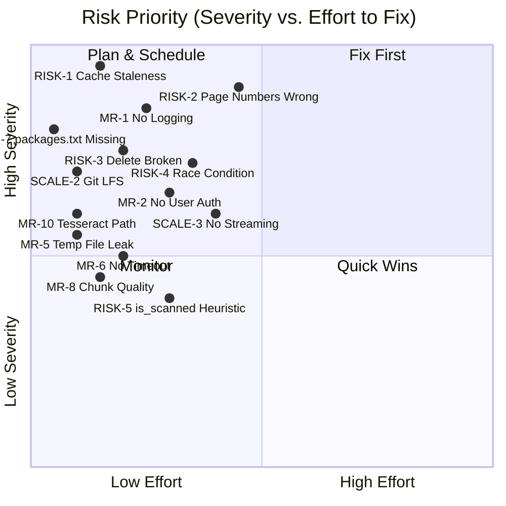

# PolicyIQ — Architectural Risk Analysis

> **Scope:** Review of [PolicyIQ_Blueprint.md](file:///Users/savyaraj/Desktop/policyiq/PolicyIQ_Blueprint.md) and [implementation_plan.md](file:///Users/savyaraj/.gemini/antigravity-ide/brain/c95a5302-7f61-4f4b-8220-a29973534384/implementation_plan.md)  
> **Context:** Portfolio/internship project — risks rated for this context, not enterprise production.

---

## Summary

| Category | Issues Found | Critical | High | Medium |
|----------|-------------|---------|------|--------|
| Architectural Risks | 5 | 2 | 2 | 1 |
| Scalability Concerns | 5 | 0 | 3 | 2 |
| Missing Requirements | 10 | 1 | 4 | 5 |

---

## Part 1 — Architectural Risks

These are design decisions that can produce **silent incorrect behavior** or **outright failures** — not just slowness.

---

### RISK-1 · Cache Staleness After Admin Upload
**Severity:** 🔴 Critical  
**Where:** `pipeline.py` → `build_chain()` + `pages/admin.py`

**What happens:**  
`build_chain()` is decorated with `@st.cache_resource`, which caches the `RetrievalQA` chain (and the FAISS retriever inside it) for the entire Streamlit session. When an admin uploads a new PDF and `update_index.py` writes the updated `index.faiss` to disk, the cached chain **still holds a reference to the old retriever object in memory**. The new document will not appear in any query results until the app is restarted — with no error, no warning, no indication to the admin.

**Root cause:** `@st.cache_resource` has no cache invalidation signal tied to file system changes.

**Mitigation:**  
After a successful `update_index()` call in `admin.py`, explicitly clear the resource cache:
```python
from rag.pipeline import build_chain
build_chain.clear()  # forces rebuild on next query
st.success("Index updated. Cache cleared — new document is now searchable.")
```
This is a one-liner fix but it is completely missing from the blueprint and roadmap.

---

### RISK-2 · Page Number Metadata Will Be Wrong for Most Chunks
**Severity:** 🔴 Critical  
**Where:** `indexing/chunker.py` → `chunk_document()`

**What happens:**  
The chunker concatenates all page text into a single string, then runs `RecursiveCharacterTextSplitter` on it. The resulting chunks span arbitrary byte offsets in that concatenated string — they do not align to page boundaries. Yet the blueprint assigns a single `page` integer to each chunk. The blueprint does not specify *which* page number gets assigned when a chunk straddles pages 4 and 5.

This is not cosmetic. The citation format is `[Source: DOCUMENT_NAME, Page: X]`. If page X is wrong by 2–3 pages, a safety engineer opens the PDF to verify the citation and finds nothing there. This **destroys trust in the system** — the single most important property for a compliance tool.

**Root cause:** The chunking model treats pagination as a property of concatenated text, not of individual chunks.

**Mitigation (two options — pick one):**  
- **Option A (simpler):** Chunk page-by-page (don't concatenate first). Each chunk stays within one page. Page metadata is always accurate. Downside: clauses that straddle a page break get split.  
- **Option B (better):** After concatenation, embed page break markers (e.g., `\n\n--- PAGE 5 ---\n\n`), then after splitting, parse the nearest preceding marker to assign the correct page number.

---

### RISK-3 · Document Deletion Is Broken by Design
**Severity:** 🟠 High  
**Where:** `indexing/deduplicator.py` → `remove_from_index()`

**What happens:**  
`remove_from_index()` removes a filename from `indexed_hashes.json`. That's all it does. The actual embedding vectors for that document's chunks remain permanently inside `index.faiss`. FAISS's `IndexFlatL2` (the default used by `FAISS.from_documents`) **does not support selective vector deletion**. This means:
- Deleting a document via the admin panel has no effect on query results
- If an outdated OISD standard is superseded by a new version, old incorrect clauses continue to be retrieved indefinitely
- The function name `remove_from_index` is actively misleading

**Root cause:** FAISS flat index architecture doesn't support vector-level deletion.

**Mitigation:**  
- **Short term:** Remove the `remove_from_index()` function entirely or rename it `remove_from_hash_registry_only()` with a clear docstring explaining it does NOT remove vectors. Document this limitation prominently in the admin panel UI and README.  
- **Long term:** To truly remove a document, the only option is to rebuild the entire index from scratch excluding that document. Add a "Rebuild Index" button to the admin panel that triggers `build_index.py` on the local machine (not on HF Spaces).

---

### RISK-4 · Race Condition on Concurrent Admin Uploads
**Severity:** 🟠 High  
**Where:** `indexing/update_index.py` + `indexing/deduplicator.py`

**What happens:**  
If two admin sessions upload PDFs simultaneously (possible since Streamlit can serve multiple browser tabs):
1. Both sessions call `is_already_indexed()` — both return False for their respective files
2. Both load the same `index.faiss` from disk into memory
3. Both call `add_documents()` on their in-memory copy
4. Both call `save_local()` — the second write **silently overwrites the first**
5. One upload is permanently lost with no error

The same race exists in `indexed_hashes.json` — a non-atomic JSON read-modify-write.

**Root cause:** No file locking or mutex around the index read-modify-write cycle.

**Mitigation (for portfolio scope):**  
Add a file-based lock using Python's `fcntl` (Unix) or `msvcrt` (Windows), or use a simple lockfile pattern:
```python
import filelock
lock = filelock.FileLock("vector_store/index.lock")
with lock:
    # load → add_documents → save
```
Add `filelock` to `requirements.txt`. This is a single-digit line change with high correctness value.

---

### RISK-5 · `is_scanned()` Heuristic Has Known False Negatives
**Severity:** 🟡 Medium  
**Where:** `indexing/parser.py` → `is_scanned()`

**What happens:**  
The heuristic checks if the average text per page is under 100 characters. This fails silently for:
- **Digitally-born PDFs with heavy table content** — tables in pdfplumber often extract as near-empty strings even when the visual content is rich. These get routed to OCR unnecessarily (slow, lower quality on already-digital text).
- **Scanned PDFs with a cover page that has a large text header** — the cover page passes the 100-char threshold, so the whole document is routed to pdfplumber, which extracts garbage from the scanned body pages.

**Root cause:** Sampling only the first 3 pages is insufficient; one-dimensional character-count heuristic is too crude.

**Mitigation:**  
- Sample pages 2, 5, and 10 (skip the cover) instead of pages 1–3
- Add a secondary check: if the extracted text has no spaces (typical of corrupted OCR), also flag as scanned
- Or: parse all pages with pdfplumber first, check the ratio of pages with <50 chars, then decide

---

## Part 2 — Scalability Concerns

These don't break the system now but will become problems as corpus size or user load grows.

---

### SCALE-1 · FAISS Flat Index — Linear Search Time
**Severity:** 🟠 High (deferred)  
**Where:** `indexing/build_index.py` → `FAISS.from_documents()`

`FAISS.from_documents()` creates an `IndexFlatL2` by default — exact brute-force nearest-neighbor search. Search time scales linearly with the number of stored vectors. For 8–12 PDFs (roughly 2,000–5,000 chunks), this is fine — sub-millisecond. At 50+ documents (~15,000+ chunks), query latency becomes noticeable. At 200+ documents, it becomes user-facing.

**Mitigation when needed:** Switch to `IndexIVFFlat` (approximate, partitioned search). This requires a training step but drops query time by 10–50×. Not needed now, but the architecture should be documented as "flat index, adequate for current corpus size."

---

### SCALE-2 · Binary Files in Git — No LFS
**Severity:** 🟠 High (long-term)  
**Where:** `vector_store/index.faiss` + `vector_store/index.pkl`

Every time the admin adds a new document and updates the index, a new version of the binary `index.faiss` is committed to Git. Git stores full binary diffs, not deltas. After 10–15 index updates, the repo history will bloat significantly. GitHub's 1GB repo limit or the 100MB file size limit may be hit.

**Mitigation:** Add Git LFS tracking for `*.faiss` and `*.pkl` files from Day 1. It's a two-command setup:
```bash
git lfs install
git lfs track "*.faiss" "*.pkl"
git add .gitattributes
```
Do this before the first index commit. Retroactively adding LFS to existing binary history is painful.

---

### SCALE-3 · No Streaming — Full Response Buffering
**Severity:** 🟠 High (UX impact)  
**Where:** `rag/generator.py` + `rag/pipeline.py`

The current design calls `chain.invoke()`, which waits for the complete LLM response before returning anything to the UI. For a 1024-token answer from LLaMA 3.3 70b, this means the user watches a spinner for 8–15 seconds before seeing any text.

Groq supports streaming via `ChatGroq(streaming=True)` + `chain.stream()`. Streamlit supports streaming output via `st.write_stream()`. Together, they'd show the first token in ~1 second.

**Mitigation:** Replace `invoke_with_retry` with a streaming equivalent using `st.write_stream()` in `chat.py`. This is a significant UX improvement — for a compliance tool where a user might ask 5–10 queries in a session, streaming makes the difference between "tool feels alive" and "tool feels broken."

---

### SCALE-4 · No Query Input Validation
**Severity:** 🟡 Medium  
**Where:** `pages/chat.py` → `st.chat_input()`

There are no guards on what goes into `ask()`:
- A 5,000-character query pasted into the chat box will push the Groq token limit, causing a `BadRequestError` that propagates as a generic `st.error()`
- Empty or whitespace-only queries will trigger a full retrieval + LLM call that returns garbage
- Maliciously crafted prompts ("Ignore all previous instructions and...") have a limited but non-zero chance of bypassing the system prompt on a compliance query

**Mitigation:**
```python
if not prompt.strip():
    st.warning("Please enter a question.")
    st.stop()
if len(prompt) > 500:
    st.warning("Query too long. Please keep questions under 500 characters.")
    st.stop()
```

---

### SCALE-5 · HF Spaces Cold Start on First Query
**Severity:** 🟡 Medium  
**Where:** Deployment on HF Spaces free tier

HF Spaces free tier sleeps after ~15 minutes of inactivity. On cold start:
- Python process restarts
- `@st.cache_resource` cache is empty
- First query triggers: model download check (~2s) + FAISS index load (~3s) + Groq API call (~5s) = **~10 second first-query lag after a 30-second wake-up delay**

The blueprint acknowledges the 30s wakeup but not the additional cold-start query lag. A user who waits 30s for the space to wake and then waits another 10s for the first answer may abandon the demo before seeing any results.

**Mitigation:** Add an explicit `st.info("⏳ Warming up models on first load... (~8 seconds)")` that shows only when `build_chain()` is being called for the first time (check via `st.session_state`). Pre-warm the chain on app startup before any user query arrives.

---

## Part 3 — Missing Requirements

Things the blueprint and roadmap do not specify that should be deliberately decided (even if the decision is "not needed for v1").

---

### MR-1 · No Logging or Observability
**Severity:** 🔴 Critical (for a real deployment; important for portfolio)  
**Gap:** There is no structured logging anywhere in the system.

If the deployed app starts returning wrong answers, there is no way to:
- Know what query triggered the failure
- Know which chunks were retrieved
- Know what the LLM received as context
- Reproduce the failure

For a compliance system, this is a fundamental gap. For a portfolio project, query logs are also your best source of evidence for improving the eval set.

**Mitigation:** Add Python `logging` module calls at minimum — log each `ask()` call with timestamp, query, and top-3 source names to a rotating log file. On HF Spaces, logs are visible in the Space's Logs tab.

---

### MR-2 · No User Access Control on Chat Portal
**Severity:** 🟠 High  
**Gap:** Anyone with the HF Spaces URL can query the system with no authentication.

This has two consequences:
1. **Groq quota exhaustion:** A single user or bot can burn through the 6,000 token/minute free tier limit for all other users
2. **Data sensitivity:** User queries are sent to Groq's API. If IOCL engineers ask real compliance questions about active operational decisions, that data leaves IOCL's boundary

**Mitigation (portfolio scope):** Add the same token-based auth to `chat.py` as exists on `admin.py`, but with a separate `EMPLOYEE_PASSWORD` secret. This gates access without full identity management. Document the data flow clearly in the README — "queries are processed via Groq's API."

---

### MR-3 · No Document Version Management
**Severity:** 🟠 High  
**Gap:** The SHA-256 deduplicator prevents re-indexing the *same* file. But OISD standards are revised periodically (e.g., OISD-118 Rev 3 → Rev 4). There is no mechanism to:
- Detect that a new file is a revision of an existing document
- Remove old version's chunks (see RISK-3)
- Track which version of each standard is currently indexed

A query against the index could retrieve a clause from a superseded version with no indication to the user that the standard has been updated.

**Mitigation:** 
- Add a `version` field to the `indexed_hashes.json` schema
- Add a naming convention: `OISD_118_Rev4_Tank_Farm_Safety.pdf` — the `source` metadata will reflect this
- Add a "Document Registry" view in the admin panel showing document name, indexed date, and file hash

---

### MR-4 · Eval Set Has No Ground Truth Answers — Only Keywords
**Severity:** 🟠 High  
**Gap:** `eval_set.json` uses keyword matching as a proxy for correctness. This creates two systematic problems:

**False negatives:** The correct answer "The minimum separation distance is 15 metres" scores False if `expected_keywords` is `["15 meters"]` (US spelling). Regulatory documents mix British/US English inconsistently.

**False positives:** An answer that says "The minimum safe distance is NOT 15 metres per the updated clause" contains the keyword `15` and `metres` and scores True — even though it's a negation.

**Mitigation:**  
- Include both spelling variants in `expected_keywords`: `["15 metres", "15 meters", "15m"]`  
- Add a `forbidden_keywords` field for known incorrect answers  
- For the 4 `numerical` query type questions especially, use exact value strings: `"minimum_value": "15"` checked via regex

---

### MR-5 · `NamedTemporaryFile` Resource Leak on HF Spaces
**Severity:** 🟡 Medium  
**Where:** `pages/admin.py`

The blueprint instructs: "save uploaded files to a `tempfile.NamedTemporaryFile`." On Windows and sometimes on Linux, `NamedTemporaryFile` with `delete=True` (default) cannot be opened by another process (like `update_index.py`) while the file handle is still open. This causes a `PermissionError` or `FileNotFoundError` that the blueprint does not address.

Additionally, if the Streamlit session ends mid-upload, the temp file is not guaranteed to be cleaned up.

**Mitigation:**
```python
import tempfile, os
with tempfile.NamedTemporaryFile(delete=False, suffix=".pdf") as tmp:
    tmp.write(uploaded_file.getbuffer())
    tmp_path = tmp.name
try:
    success, msg = update_index(tmp_path)
finally:
    os.unlink(tmp_path)  # explicit cleanup
```

---

### MR-6 · No LLM Call Timeout
**Severity:** 🟡 Medium  
**Where:** `rag/generator.py`

The blueprint handles `RateLimitError` with retry + backoff. But it does not handle **timeout** — if Groq's API is slow or partially degraded, `chain.invoke()` can hang for 30–120 seconds with the Streamlit UI showing a spinner and no way to cancel. Streamlit has no built-in request timeout.

**Mitigation:**
```python
import signal
# Or use httpx timeout via ChatGroq's http_client parameter:
ChatGroq(model=MODEL_NAME, ..., http_client=httpx.Client(timeout=30.0))
```
Set a 30-second wall-clock timeout. If exceeded, raise a `TimeoutError` and display `st.warning("Request timed out. Groq API may be slow. Try again in a few seconds.")`.

---

### MR-7 · `packages.txt` Missing for HF Spaces System Dependencies
**Severity:** 🟡 Medium  
**Where:** Phase 6 — Deployment

HF Spaces with Streamlit SDK reads system package requirements from a `packages.txt` file in the repo root (one package per line). The blueprint covers `requirements.txt` for Python deps but **never mentions `packages.txt`**. Without it:
- Tesseract is not installed on the Space → `pytesseract` throws `TesseractNotFoundError` on any scanned PDF
- Poppler is not installed → `pdf2image` fails with `PDFInfoNotInstalledError`

This will cause a runtime crash on the first scanned PDF uploaded via the admin panel.

**Mitigation:** Create `packages.txt` in the repo root:
```
tesseract-ocr
poppler-utils
```
This is a 2-line file that the roadmap and blueprint both omit entirely.

---

### MR-8 · No Chunk Quality Filter
**Severity:** 🟡 Medium  
**Where:** `indexing/chunker.py` → `chunk_document()`

After chunking, some chunks will contain near-zero semantic content:
- Page headers/footers: `"OISD-118 SECTION 4 ............ 12"`
- Table of contents entries: `"4.1.2 Water Storage .... 45"`  
- Blank pages: whitespace only
- Repeated boilerplate: `"For Official Use Only"`

These chunks pollute the FAISS index. If retrieved (they often are, since they contain keywords), they consume one of the `k=5` retrieval slots without contributing any useful context to the LLM, reducing effective context quality.

**Mitigation:** Add a filter step in `chunk_document()`:
```python
MIN_CHUNK_WORDS = 20
chunks = [c for c in chunks if len(c.page_content.split()) >= MIN_CHUNK_WORDS]
```
A 20-word minimum filters boilerplate without touching legitimate short clauses.

---

### MR-9 · Git History Will Contain Index Rebuild Artifacts
**Severity:** 🟡 Medium  
**Where:** Workflow — not a code issue

The workflow is: rebuild index locally → `git add vector_store/` → `git commit` → `git push`. Over time:
- Every index update creates a large binary commit
- `git log` for `vector_store/` becomes meaningless
- Reverting to a previous index version requires `git checkout <hash> -- vector_store/` — fragile and undocumented

**Mitigation:**  
- Use a dedicated git commit convention: `"chore: rebuild index — added OISD_150"` so the history is at least readable  
- Or: use a separate orphan branch `index-artifacts` for vector store files, keeping `main` clean. Document the branch strategy in README.

---

### MR-10 · No `packages.txt` + No `README` for Local OCR Path Setup
**Severity:** 🟡 Medium  
**Where:** Onboarding / `parser.py`

The Tesseract binary path varies by OS and installation method:
- Linux: `/usr/bin/tesseract`  
- Mac Intel: `/usr/local/bin/tesseract`  
- Mac Apple Silicon: `/opt/homebrew/bin/tesseract`

The blueprint mentions this in the error section (Error 8) but the `parser.py` prompt hardcodes the Linux path only. A developer on a Mac (which is the stated dev environment) will hit `TesseractNotFoundError` immediately on first run of `parser.py` with no clear error message pointing to the path issue.

**Mitigation:** In `parser.py`, auto-detect the path:
```python
import shutil
tesseract_path = shutil.which("tesseract")
if tesseract_path:
    pytesseract.pytesseract.tesseract_cmd = tesseract_path
else:
    raise RuntimeError("Tesseract not found. Install with: brew install tesseract (Mac) or apt install tesseract-ocr (Linux)")
```

---

## Risk Priority Matrix



---

## Recommended Fix Order (Before Coding Begins)

These fixes require zero new code files — they are amendments to the build plan:

| Priority | Fix | Effort | Phase to Apply |
|----------|-----|--------|---------------|
| 1 | Create `packages.txt` with `tesseract-ocr` and `poppler-utils` | 2 min | Phase 0 |
| 2 | Add Git LFS for `*.faiss` and `*.pkl` | 5 min | Phase 0 |
| 3 | Auto-detect Tesseract path with `shutil.which()` in `parser.py` | 5 min | Phase 1 |
| 4 | Add 20-word minimum chunk filter in `chunker.py` | 5 min | Phase 1 |
| 5 | Add `filelock` to `requirements.txt` + wrap `update_index()` | 15 min | Phase 2 |
| 6 | Fix temp file cleanup in `admin.py` with `delete=False` + `os.unlink()` | 10 min | Phase 4 |
| 7 | Add `build_chain.clear()` call in `admin.py` after successful upload | 2 min | Phase 4 |
| 8 | Add query length validation in `chat.py` | 5 min | Phase 4 |
| 9 | Add 30s Groq API timeout via `httpx.Client` | 10 min | Phase 3 |
| 10 | Add basic `logging` calls to `pipeline.py` | 15 min | Phase 3 |

**The two items that require an architectural decision (not just a code fix):**
- **RISK-2 (Page metadata):** Choose Option A or B before writing `chunker.py`. Retrofitting this later requires rebuilding the entire index.
- **RISK-3 (Document deletion):** Decide the public contract of `remove_from_index()` before it's called from the admin panel. Rename or document clearly.
