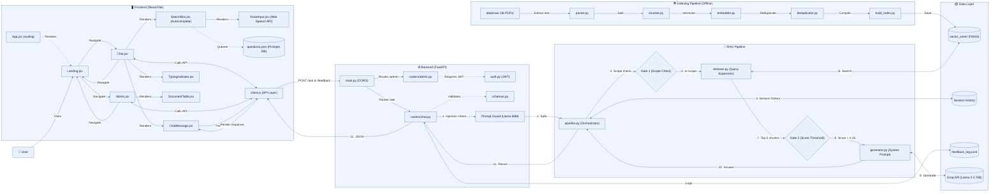

```mermaid
%%{init: {'theme': 'base', 'themeVariables': {'darkMode': false, 'primaryColor': '#e8f0fe', 'primaryTextColor': '#1a1a2e', 'primaryBorderColor': '#4a6fa5', 'lineColor': '#4a6fa5', 'secondaryColor': '#f0faf5', 'tertiaryColor': '#fff8e8', 'clusterBkg': '#f0f4ff', 'clusterBorder': '#4a6fa5', 'titleColor': '#1a1a2e', 'edgeLabelBackground': '#ffffff', 'nodeTextColor': '#1a1a2e'}}}%%
flowchart LR
    User["👤 User"]
    subgraph Frontend ["🖥️ Frontend (React/Vite)"]
        direction TB
        App["App.jsx (routing)"]
        Landing["Landing.jsx"]
        Chat["Chat.jsx"]
        Admin["Admin.jsx"]
        SearchBox["SearchBox.jsx (Autocomplete)"]
        VoiceInput["VoiceInput.jsx (Web Speech API)"]
        QuestionsDB[("questions.json (Prompts DB)")]
        ChatMsg["ChatMessage.jsx"]
        Typing["TypingIndicator.jsx"]
        DocTable["DocumentTable.jsx"]
        Client["client.js (API Layer)"]
        App -.->|"Renders"| Landing
        Landing -->|"Navigate"| Chat
        Landing -->|"Navigate"| Admin
        Chat -->|"Navigate"| Landing
        Admin -->|"Navigate"| Landing
        Chat -->|"Renders"| SearchBox
        SearchBox -->|"Renders"| VoiceInput
        SearchBox -.->|"Queries"| QuestionsDB
        Chat -->|"Renders"| ChatMsg
        Chat -->|"Renders"| Typing
        Admin -->|"Renders"| DocTable
        Chat <-->|"Calls API"| Client
        Admin <-->|"Calls API"| Client
        ChatMsg -->|"Feedback"| Client
        Client -->|"Render response"| ChatMsg
    end
    subgraph Backend ["⚙️ Backend (FastAPI)"]
        direction TB
        Main["main.py (CORS)"]
        ChatRouter["routers/chat.py"]
        AdminRouter["routers/admin.py"]
        Auth["auth.py (JWT)"]
        Schemas["schemas.py"]
        PromptGuard["Prompt Guard (Llama 86M)"]
    end
    subgraph RAG ["🧠 RAG Pipeline"]
        direction TB
        Pipeline["pipeline.py (Orchestrator)"]
        Gate1{"Gate 1 (Scope Check)"}
        Retriever["retriever.py (Query Expansion)"]
        Gate2{"Gate 2 (Score Threshold)"}
        Generator["generator.py (System Prompt)"]
    end
    subgraph Data ["📦 Data Layer"]
        direction TB
        VectorStore[("vector_store/ (FAISS)")]
        Memory[("Session History")]
        FeedbackLog[("feedback_log.jsonl")]
        Groq[("Groq API (Llama 3.3 70B)")]
    end
    subgraph Indexing ["🛠️ Indexing Pipeline (Offline)"]
        direction LR
        Raw["data/raw/ (36 PDFs)"]
        Parser["parser.py"]
        Chunker["chunker.py"]
        Embedder["embedder.py"]
        Dedup["deduplicator.py"]
        Builder["build_index.py"]
        Raw -->|"Extract text"| Parser
        Parser -->|"Split"| Chunker
        Chunker -->|"Vectorise"| Embedder
        Embedder -->|"Deduplicate"| Dedup
        Dedup -->|"Compile"| Builder
        Builder -->|"Save"| VectorStore
    end
    User -->|"Visits"| Landing
    Client -->|"POST /ask & /feedback"| Main
    Main -->|"Routes /ask"| ChatRouter
    Main -->|"Routes /admin"| AdminRouter
    AdminRouter -.->|"Requires JWT"| Auth
    ChatRouter -.->|"Validates"| Schemas
    ChatRouter -->|"1. Injection check"| PromptGuard
    PromptGuard -->|"2. Safe"| Pipeline
    ChatRouter -->|"Logs"| FeedbackLog
    Pipeline <-->|"3. Session history"| Memory
    Pipeline -->|"4. Scope check"| Gate1
    Gate1 -->|"5. In-scope"| Retriever
    Retriever <-->|"6. Search"| VectorStore
    Retriever -->|"7. Top-5 chunks"| Gate2
    Gate2 -->|"8. Score > 0.25"| Generator
    Generator <-->|"9. Generate"| Groq
    Generator -->|"10. Answer"| Pipeline
    Pipeline -->|"11. Result"| ChatRouter
    ChatRouter -->|"12. JSON"| Client
```